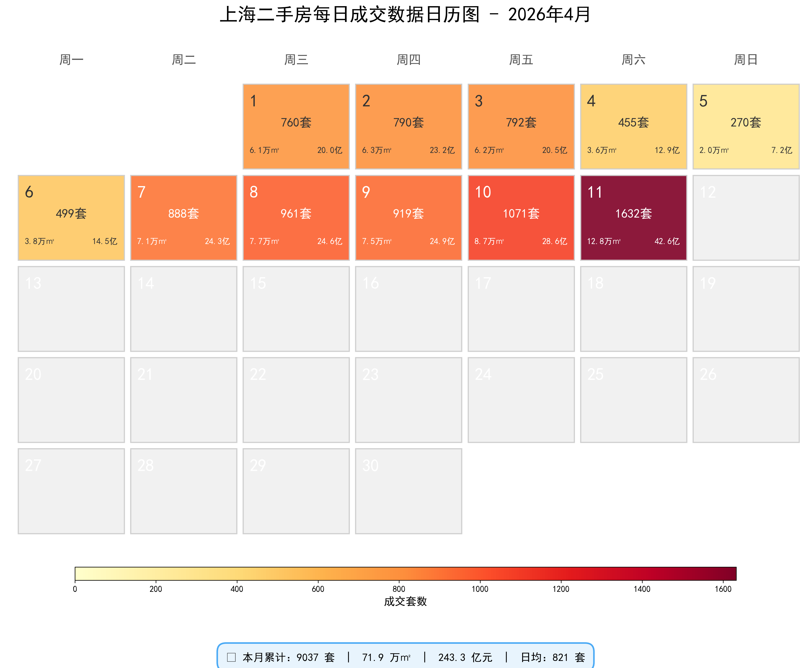
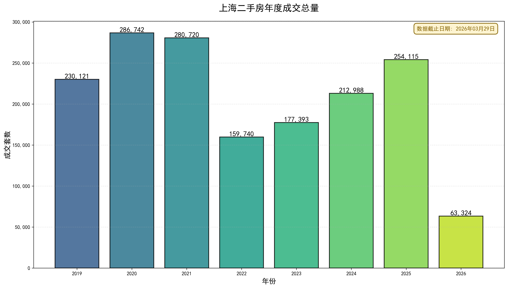
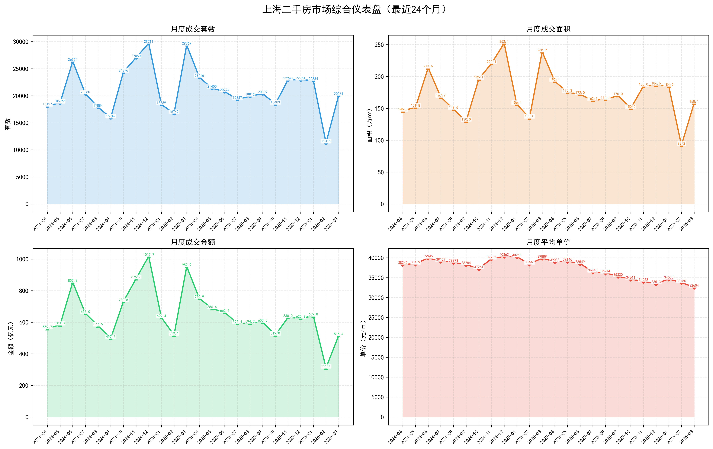
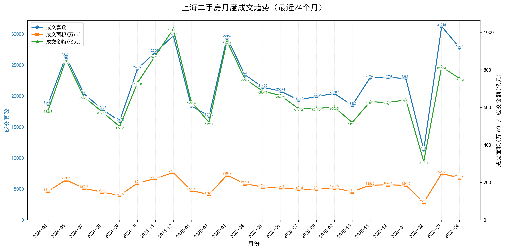
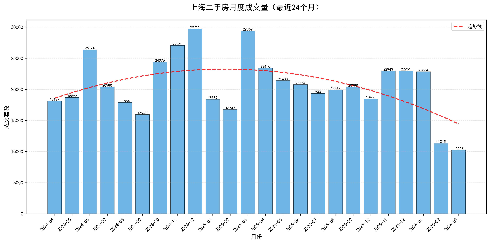
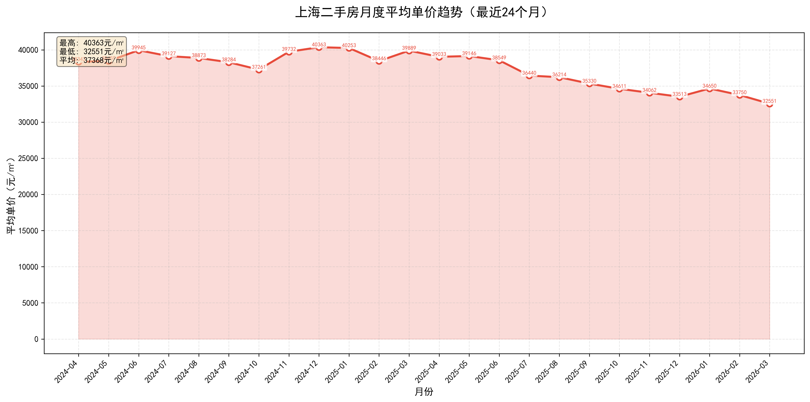

# 上海二手房网签数据记录

统计每日上海二手房网签数据，数据来源：[网上房地产](https://www.fangdi.com.cn/old_house/old_house.html)

> 注意：官方数据包含商业、车位，所以套数会略高，均价会较低

## 本月成交

## 历年成交

## 数据总览

## 月度成交趋势

## 成交均价

因为商业车位拉低了均价，具体数值意义不大，主要看趋势

## Star History

